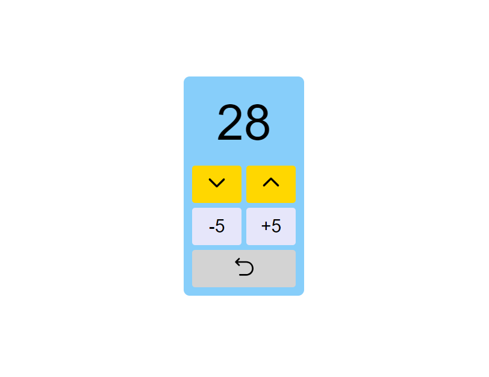

# ReactJS Counter

A simple and interactive counter application built with React.js. This project demonstrates basic React concepts including state management and event handling.

## Screenshot

  <!-- Replace with the path to your screenshot image -->

## Live Demo

You can try out the live demo of this project [here](https://reactjs-counter.vercel.app/).

## Features

- Increase by 1
- Decrease by 1
- Increase by 5
- Decrease by 5
- Reset (sets the counter value to zero)
- Responsive design

## Installation

### Using Create React App

To get started with the project locally using Create React App, follow these steps:

1. **Clone the repository:**

    ```bash
    git clone https://github.com/EthanEDev/reactjs-counter.git
    ```

2. **Navigate to the project directory:**

    ```bash
    cd reactjs-counter
    ```

3. **Install dependencies:**

    ```bash
    npm install
    ```

4. **Start the development server:**

    ```bash
    npm start
    ```

### Using Vite

If the project uses Vite instead of Create React App, follow these steps:

1. **Clone the repository:**

    ```bash
    git clone https://github.com/EthanEDev/reactjs-counter.git
    ```

2. **Navigate to the project directory:**

    ```bash
    cd reactjs-counter
    ```

3. **Install dependencies:**

    ```bash
    npm install
    ```

4. **Start the development server:**

    ```bash
    npm run dev
    ```

## Usage

Once the application is running, you can use the following features:

- **Increase by 1**: Click the "UP" button to increase the counter value by 1.
- **Decrease by 1**: Click the "DOWN" button to decrease the counter value by 1.
- **Increase by 5**: Click the "+5" button to increase the counter value by 5.
- **Decrease by 5**: Click the "-5" button to decrease the counter value by 5.
- **Reset**: Click the "Reset" button to set the counter value to zero.

## Technologies Used

- React.js
- JavaScript (ES6+)
- CSS

## Contributing

Contributions are welcome! If you have suggestions for improvements or find bugs, please open an issue or submit a pull request.

1. Fork the repository.
2. Create a new branch (`git checkout -b feature-branch`).
3. Commit your changes (`git commit -am 'Add new feature'`).
4. Push to the branch (`git push origin feature-branch`).
5. Create a new Pull Request.

## License

This project is licensed under the MIT License - see the [LICENSE](LICENSE) file for details.

## Contact

If you have any questions, feel free to reach out to me via GitHub issues or at [ethan.ekhtiyar@gmail.com](mailto:ethan.ekhtiyar@gmail.com).
